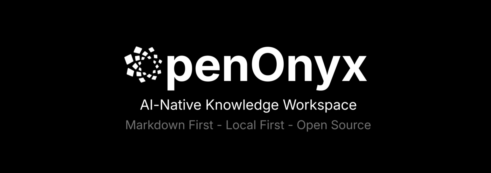
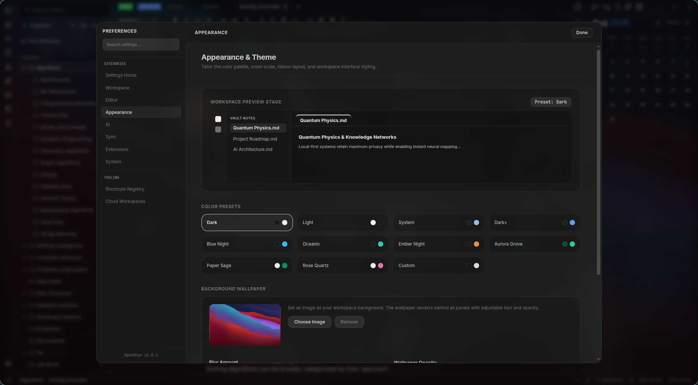
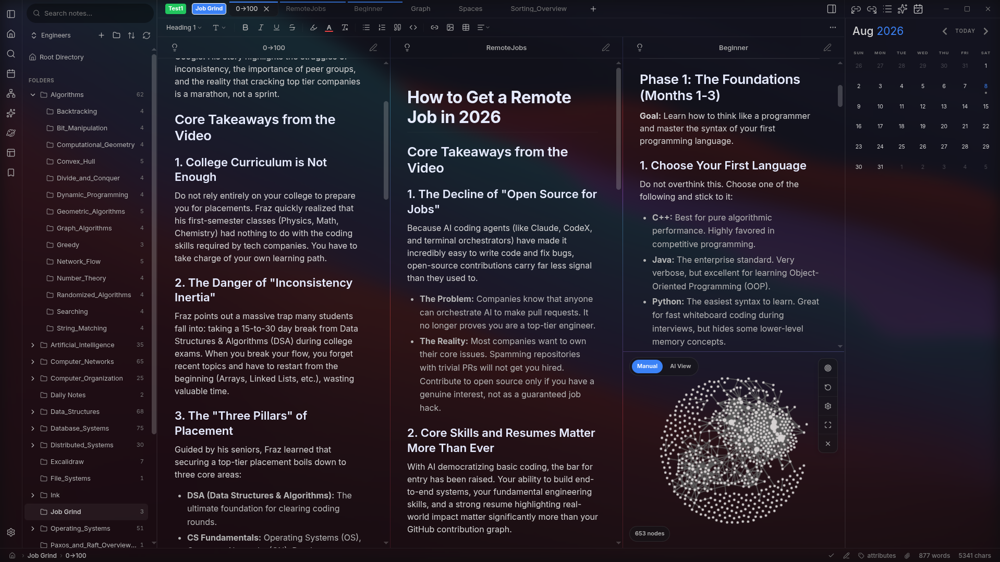

# OpenOnyx

<p align="center">
  
</p>

<p align="center">
  <strong>A local-first, AI-assisted knowledge workspace for Markdown vaults.</strong>
</p>

<p align="center">
  <a href="LICENSE"></a>
  
  
  
  
</p>

OpenOnyx is a professional desktop knowledge management app built around plain Markdown files, Obsidian-style workflows, graph navigation, local semantic indexing, and optional cloud collaboration. It is designed for people who want ownership of their notes while still having a modern thinking layer for search, synthesis, writing assistance, and knowledge exploration.

The app is built with Electron, React, TypeScript, CodeMirror, D3, Tailwind CSS, Transformers.js, IndexedDB, and Supabase.


## Why OpenOnyx

OpenOnyx is for writers, researchers, engineers, students, and teams who want a serious knowledge base without surrendering their files to a proprietary silo.

| Principle | What it means |
| --- | --- |
| Local-first by default | Notes are normal files in normal folders. Core workflows work offline. |
| Markdown-native | Your writing stays portable, readable, and tool-friendly. |
| AI where it helps | Retrieval, suggestions, summaries, and inline writing tools are grounded in your vault. |
| Cloud when you choose | Supabase-backed sync, collaboration, and public Spaces are optional. |
| Plugin-aware | OpenOnyx targets Obsidian plugin compatibility through a tested runtime layer. |

## Feature Tour

### 1. Markdown Workspace

Write in a fast CodeMirror-powered editor with live preview, source mode, split panes, tab groups, backlinks, tags, outline, properties, and wiki links. OpenOnyx keeps the editing surface focused while making surrounding context available when you need it.

Key capabilities:

- Markdown editing with live preview and sanitized rendering
- Wiki links with `[[note-name]]` syntax
- KaTeX math support
- Backlinks, outgoing links, unlinked mentions, tags, outline, and properties panels
- Split panes, multi-tab workspaces, tab groups, and recent vault history
- Vim mode support with editor commands for common workflows
- Interactive WYSIWYG table editor that replaces raw pipe-syntax markdown with an inline-editable table, complete with row/column insertion tools and cell caret synchronization.

<p align="center">
  
</p>

### 2. Vault Navigation and Search

Move through large vaults with quick switching, global search, in-note search, bookmarks, daily notes, context menus, and a file explorer that keeps ordinary folders as the source of truth.

Key capabilities:

- Fuzzy vault search and quick switcher
- Search and replace inside the active note
- Daily note creation
- Bookmarks and recent vault workflows
- File explorer actions for notes, folders, assets, and canvases
- Global keyboard shortcuts for fast navigation

### 3. Knowledge Graph

Explore relationships between notes through an interactive graph built for local vaults. The graph helps reveal dense clusters, isolated notes, hidden relationships, and important hubs in the knowledge base.

Key capabilities:

- Interactive note graph with configurable physics and display settings
- Canvas2D rendering path for larger graph views
- Search, focus, filtering, and node centering tools
- Persistent layout and theme-aware graph styling
- Edge and node controls for precise exploration

<p align="center">
  
</p>

### 4. AI Knowledge Graph

Use semantic similarity and graph analysis to surface relationships that are not obvious from manual links alone. The AI graph can highlight suggested links, bridge notes, idea islands, central concepts, clusters, and directional reading flows.

Key capabilities:

- Semantic graph generation from local embeddings
- Suggested connections between related notes
- Bridge note insights across clusters
- Idea island detection for isolated topic groups
- Focus cards for concepts, links, clusters, and generated explanations
- Configurable thresholds, node limits, and cluster breadth

<p align="center">
  
</p>

### 5. Canvas

Create visual maps of notes, ideas, and relationships with Obsidian-style `.canvas` support. Canvas files stay portable and live beside the rest of the vault.

Key capabilities:

- Obsidian-style `.canvas` document support
- Canvas nodes, edges, toolbar controls, and recent canvas tracking
- Duplicate and save-as flows
- Markdown note embedding inside visual layouts
- Compatibility tests for canvas document behavior

<p align="center">
  
</p>

### 6. Spaces

Spaces turn a vault into a queryable knowledge layer. A Space indexes notes, chunks content, creates embeddings, and lets users ask contextual questions over their own material.

Key capabilities:

- Local Spaces stored in IndexedDB
- Private and public cloud-backed Spaces through Supabase
- Browser-native embeddings with `@xenova/transformers`
- RAG chat with source citations back to notes
- Suggested queries, indexing progress, and vault previews
- Public Space discovery, upvotes, and Remix/fork workflows

<p align="center">
  
</p>

### 7. AI Writing and Synthesis

OpenOnyx includes optional AI assistance for writing, editing, synthesis, and vault-level reasoning. Remote LLM providers are used only when configured.

Key capabilities:

- Inline AI writing actions in the editor
- Retrieval-grounded answers from Spaces
- Note annotations and related-note suggestions
- Contradiction, expansion, and synthesis hints
- Configurable OpenAI and OpenRouter providers
- Source-aware responses designed for vault context

<p align="center">
  
</p>

### 8. Sync and Collaboration

Cloud features are optional, but when enabled OpenOnyx can sync Spaces, preserve offline edits, and support collaborative workflows through a Supabase-backed data model.

Key capabilities:

- Optional Supabase authentication
- Offline-first sync queue with retry handling
- Deduplication of pending local mutations
- Last-write-wins conflict resolution
- Local IndexedDB cache for durable offline state
- Supabase `pgvector` schema for semantic matching
<p align="center">
  
</p>

### 9. Plugin System

OpenOnyx includes an Obsidian-compatible runtime layer and a plugin management experience for community-style plugins.

Key capabilities:

- Obsidian API compatibility layer based on the official `obsidian` package
- Plugin marketplace and local plugin management UI
- Commands, ribbon actions, status bar items, settings tabs, custom views, and sidebars
- Markdown processors, editor extensions, lifecycle cleanup, and compatibility checks
- Runtime isolation, permission prompts, manifest caching, and crash containment
- Regression tests against real community plugin bundles

<p align="center">
  
</p>

### 10. Themes and Interface

The interface is built for long working sessions: quiet surfaces, readable typography, restrained contrast, and theme-aware components across the editor, graph, settings, modals, and plugin views.

Key capabilities:

- Dark, light, oceanic, and custom theme support
- Theme-aware graph and editor surfaces
- Responsive pane layout
- Command palette, modals, settings pages, and status bar
- Logo and icon assets in `public/`

<p align="center">
  
</p>


### 11. Custom Wallpaper Backgrounds

Customize your environment by uploading any custom image to serve as the application-level wallpaper. Panel translucency overlays automatically adjust to blend with your background.

Key capabilities:

- Upload and apply any custom image files as the application background
- Adjustable background blur controller to soften the wallpaper details
- Adjustable background opacity controller to maintain perfect typography contrast
- Fully translucent panel options for the editor, left sidebar, and right sidebar panels

<p align="center">
  
</p>

### 12. Export and Compatibility Tooling

OpenOnyx includes compatibility infrastructure for export plugins and plugin runtimes that expect desktop APIs.

Key capabilities:

- Managed Pandoc 3.10 WASM backend for export plugins
- Electron and Node compatibility shims for plugin workflows
- Canvas compatibility tests
- Obsidian API runtime export checks
- Live compatibility scripts for selected plugins

### Installation & Downloads

Download official binaries for your platform from the [GitHub Releases Page](https://github.com/OpenOnyx/OpenOnyx/releases).

#### Platform Notes:
- **macOS Gatekeeper**: If macOS shows *"OpenOnyx.app cannot be opened because it is from an unidentified developer"* or *"damaged and cannot be opened"*, right-click `OpenOnyx.app` → select **Open**, or run this command in Terminal after moving to Applications:
  ```bash
  xattr -cr /Applications/OpenOnyx.app
  ```
- **Windows**: Download `.exe` installer from Releases. Free code signing provided by [SignPath.io](https://signpath.io/) and certificate by [SignPath Foundation](https://signpath.org/).
- **Linux**: Download `.AppImage`, `.deb`, `.rpm`, or `.pkg.tar.zst` from Releases, or run `curl -fsSL https://raw.githubusercontent.com/OpenOnyx/OpenOnyx/main/scripts/install.sh | bash`.

### Prerequisites

- Node.js 24.x or newer
- npm 9.x or newer

### Run Locally

```bash
git clone https://github.com/OpenOnyx/OpenOnyx.git
cd OpenOnyx
npm install
npm run dev
```

`npm run dev` builds the Electron main process, starts Vite on port `5173`, and launches the Electron app against the local dev server.

If Electron's postinstall download was skipped or interrupted, the dev launcher will try to repair `node_modules/electron` automatically before starting the desktop app. If the repair cannot download Electron because of a network or proxy issue, run:

```bash
npm config set ignore-scripts false
npm rebuild electron
npm run dev
```

### Build a Desktop Package

```bash
npm run package
```

Electron Builder writes distributable artifacts to `release/`.

Platform-specific builds:

- `npm run package:win` builds Windows `.exe` installers.
- `npm run package:mac` builds macOS `.dmg` and `.zip` artifacts.
- `npm run package:linux` builds Linux `.AppImage`, `.deb`, `.rpm`, and Arch pacman package artifacts.
- `npm run package:all` requests every configured target. Use CI for real cross-platform releases because macOS installers must be produced on macOS.

GitHub release builds are handled by `.github/workflows/release.yml`. Push a tag such as `v1.0.0`, or run the workflow manually with a tag, and the workflow will attach the Windows, macOS, and Linux installer files to the GitHub Release.

On Arch-based local machines, the `.deb`, `.rpm`, and pacman targets require `libxcrypt-compat` for Electron Builder's bundled `fpm` tool. The GitHub workflow installs the Ubuntu equivalent automatically.

Package-manager publishing templates for AUR, Homebrew, and winget are documented in [`docs/release/package-distribution.md`](docs/release/package-distribution.md).

## Configuration

OpenOnyx runs without environment variables for local vault editing, local search, local embeddings, local graphs, and local Spaces.

Cloud-backed features require Supabase:

```bash
cp .env.example .env.local
```

Then set:

```env
VITE_SUPABASE_URL=https://your-project-id.supabase.co
VITE_SUPABASE_ANON_KEY=your-anon-key-here
```

### Supabase Setup

1. Create a Supabase project.
2. Enable the `vector` extension in **Database > Extensions**.
3. Open **SQL Editor** and run [`supabase/schema.sql`](supabase/schema.sql).
4. Copy the project URL and anon key from **Project Settings > API**.
5. Add those values to `.env.local` or paste them into the in-app database settings.

Optional OAuth redirect configuration:

```env
VITE_SUPABASE_REDIRECT_URL=https://your-project-id.supabase.co/auth/v1/callback
```

### AI Provider Setup

Local embeddings do not require an API key. Remote generation features use provider credentials configured in the app settings for OpenAI or OpenRouter.

## Development

Common commands:

| Command | Description |
| --- | --- |
| `npm run dev` | Build Electron, start Vite, and launch the desktop app |
| `npm run build` | Type-check, build the renderer, and build Electron |
| `npm run build:electron` | Compile the Electron main and preload process |
| `npm run package` | Build and package desktop installers |
| `npm run lint` | Run TypeScript with `--noEmit` |

The Vite dev server uses:

```text
http://localhost:5173
```

Useful development environment variables:

| Variable | Purpose |
| --- | --- |
| `VITE_DEV_SERVER_URL` | Override the renderer URL loaded by Electron |
| `OPENONYX_DEBUG_PORT` | Enable Chromium remote debugging for Electron |
| `OPENONYX_VERBOSE_CHROMIUM_LOGS=1` | Keep verbose Chromium logs in development |
| `OPENONYX_PANDOC_DIR` | Override the managed Pandoc backend directory |
| `OPENONYX_PANDOC_ARCHIVE` | Install Pandoc backend from a local archive |
| `OPENONYX_PANDOC_WASM` | Override the Pandoc WASM path used by the runner |

## Testing

### All-in-One Verification
Contributors can verify their changes against compilation, API definitions, document processors, unit tests, integration sandboxes, and build integrity configurations using a single command. This command automatically sets up any missing prerequisites (like Pandoc WASM and plugin fixtures) to ensure execution succeeds:

```bash
npm run test:all-checks
```

### Running Specific Tests
You can also trigger individual test runs manually:

```bash
# Compilation check / Type check
npm run lint

# Test the settings and build installer packaging configuration
npx vitest run tests/build-integrity.test.ts

# Test general features (tab groups, embedding cache, etc.)
npx vitest run tests/tab-groups.test.ts tests/embedding-cache.test.ts

# Test Obsidian API sandbox compatibility runtime layer
npm run test:plugin-runtime
```

Pandoc-backed export compatibility:

```bash
npm run install:pandoc-backend
npm run test:pandoc-backend
```

Live plugin tests are available for selected plugins:

```bash
npm run test:kanban-live
npm run test:excalidraw-live
npm run test:notebook-navigator-live
```

Some live tests expect a vault path through environment variables such as `OO_KANBAN_VAULT`, `OO_EXCALIDRAW_VAULT`, or `OO_NOTEBOOK_NAVIGATOR_VAULT`.

## Architecture

OpenOnyx uses Electron's multi-process model with a strict boundary between the renderer and local system access.

```text
Renderer Process
React, CodeMirror, D3, Spaces UI, plugin UI, local AI workers
        |
        | window.electronAPI
        v
Preload Process
contextBridge IPC surface
        |
        | ipcRenderer / ipcMain
        v
Main Process
window lifecycle, vault filesystem, search index, dialogs, shell integration
        |
        v
Local Vault
Markdown files, canvas files, assets, .openonyx cache
```

Core principles:

- Local-first storage: notes are ordinary files, and local indexes stay on device by default.
- Context isolation: renderer code cannot directly access Node.js APIs.
- Async filesystem access: vault operations are routed through IPC handlers.
- Durable local state: IndexedDB stores Spaces, chunks, vector indexes, sync metadata, and pending mutations.
- Optional remote services: Supabase and LLM providers are used only for features that need them.
- Plugin compatibility: the runtime exposes Obsidian-like APIs while keeping plugin execution contained.

## Project Structure

```text
.
|-- electron/                    # Electron main, preload, IPC, filesystem, search
|-- src/
|   |-- components/              # React UI: editor, graph, canvas, settings, plugins, spaces
|   |-- context/                 # Shared React context
|   |-- editor/                  # CodeMirror extensions
|   |-- keybindings/             # Global keyboard behavior
|   |-- lib/                     # Supabase, sync, local DB, plugin manager, Obsidian API
|   |-- styles/                  # Theme and generated-document style helpers
|   |-- types/                   # TypeScript domain types
|   `-- utils/                   # AI, embeddings, RAG, filesystem helpers, app utilities
|-- supabase/
|   |-- schema.sql               # Tables, RLS, pgvector functions, sync schema
|   `-- functions/               # Edge functions for chat and embeddings
|-- docs/                        # Architecture, feature docs, and screenshot slots
|   `-- images/                  # README screenshots and feature images
|-- scripts/                     # Dev, compatibility, fixture, and Pandoc scripts
|-- tests/                       # Vitest and runtime compatibility tests
|-- public/                      # Logos, icons, and static assets
|-- vite.config.ts               # Vite, React, Tailwind, and WASM runtime aliases
`-- package.json                 # Scripts, dependencies, and Electron Builder config
```

## Plugin Compatibility

OpenOnyx targets the public Obsidian plugin API using the official `obsidian` npm package as its baseline.

Current compatibility coverage includes:

- Runtime export audit against `obsidian@1.13.1`
- CodeMirror 6 and legacy CodeMirror 5 access patterns
- Commands, ribbon icons, status bars, modals, settings tabs, sidebars, custom views, workspace leaves, Markdown processors, and cleanup lifecycles
- Node/Electron compatibility shims for plugins that expect desktop APIs
- Managed Pandoc 3.10 WASM backend for export plugins
- Regression tests for real plugin bundles including Dataview, Templater, Tasks, Calendar, Kanban, Style Settings, Advanced Tables, QuickAdd, Obsidian Git, Excalidraw, Better Export PDF, Enhancing Export, and Reading Time

See [`docs/obsidian-plugin-compatibility.md`](docs/obsidian-plugin-compatibility.md) for the full compatibility matrix and verification flow.

## Privacy and Security

- Core note editing, search, graph navigation, local embeddings, and local Spaces work offline.
- Notes are stored as local files in the selected vault.
- Local indexes, embeddings, and caches stay on device unless the user enables cloud-backed features.
- The renderer runs with context isolation and talks to the filesystem through a preload IPC bridge.
- Supabase is optional and used for authentication, sync, collaboration, public Spaces, and vector search.
- Remote LLM providers are optional and receive only the prompts/context needed for the selected AI workflow.
- Private Spaces are designed around client-side encryption and key wrapping.
- The project does not include product analytics or telemetry.

## Keyboard Shortcuts

| Shortcut | Action |
| --- | --- |
| `Ctrl+N` / `Cmd+N` | Create note |
| `Ctrl+S` / `Cmd+S` | Save current note |
| `Ctrl+F` / `Cmd+F` | Search inside current note |
| `Ctrl+Shift+F` / `Cmd+Shift+F` | Search vault |
| `Ctrl+O` / `Cmd+O` | Quick switcher |
| `Ctrl+P` / `Cmd+P` | Command palette |
| `Ctrl+G` / `Cmd+G` | Open graph |
| `Ctrl+Shift+C` / `Cmd+Shift+C` | Create or open canvas |
| `Ctrl+B` / `Cmd+B` | Toggle sidebar |
| `Ctrl+Tab` | Next tab |
| `Ctrl+Shift+Tab` | Previous tab |
| `Ctrl+W` / `Cmd+W` | Close active tab |
| `Escape` | Close modal or transient panel |

## Documentation

The product website and user guide live in [`website/`](website/):

```bash
cd website
npm install
npm run dev
```

- [`website/`](website/) — marketing site, interactive vault graph, and user docs
- [`docs/spaces.md`](docs/spaces.md) — Spaces architecture, indexing, RAG, storage, sync
- [`docs/obsidian-plugin-compatibility.md`](docs/obsidian-plugin-compatibility.md) — plugin API coverage and the real-plugin regression matrix
- [`changelog.md`](changelog.md) — project changes

## Contributing

1. Fork the repository.
2. Create a focused feature branch.
3. Install dependencies with `npm install`.
4. Make the change using the existing architecture and style.
5. Run the relevant checks, at minimum `npm run lint`.
6. Open a pull request with a clear description of the behavior changed and the verification performed.

For changes that touch plugins, Spaces, sync, AI retrieval, filesystem behavior, or Electron IPC, include the matching compatibility or integration tests where practical.

## License

OpenOnyx is released under the [Apache License 2.0](LICENSE).
