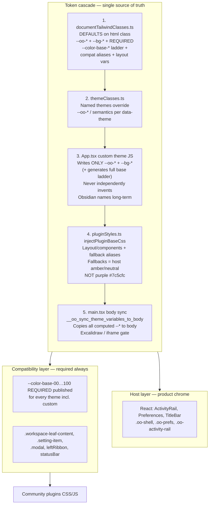
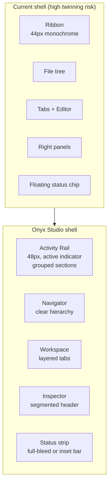
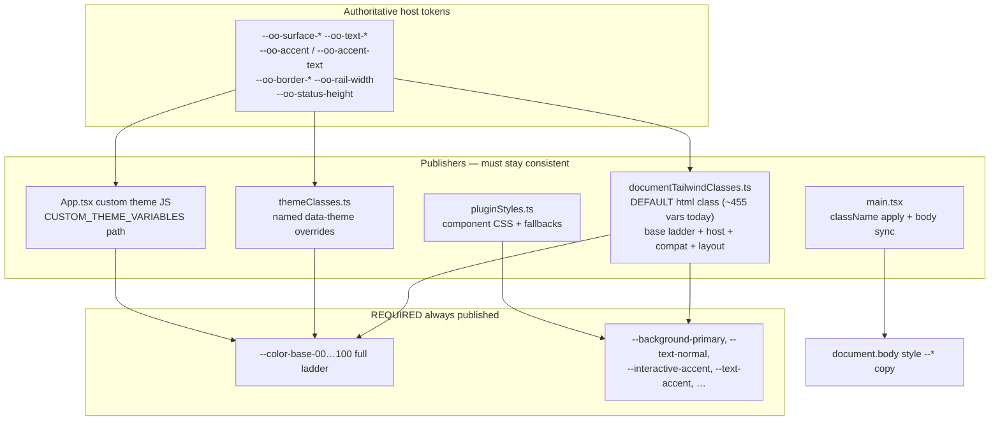
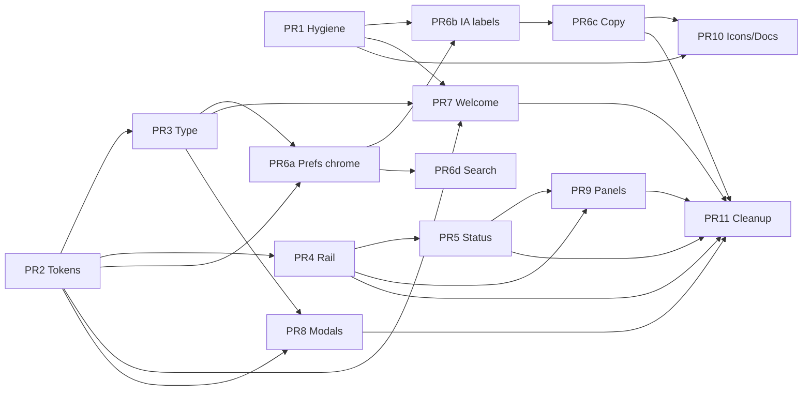

# OpenOnyx Visual Identity & UI/UX Redesign (Visual-Only)

| Field | Value |
| --- | --- |
| **Document title** | OpenOnyx Visual Identity & UI/UX Redesign |
| **Author** | _TBD — OpenOnyx design / eng_ |
| **Date** | 2026-07-29 |
| **Status** | Draft |
| **Scope** | Visual identity, chrome, copy, tokens, icons — **no feature or architecture changes** |
| **Workspace** | `/Users/rishijat/Desktop/OpenOnyx` |
| **Design language name** | **Onyx Studio** (working title) |

---

## Overview

OpenOnyx is a local-first, AI-assisted knowledge workspace for Markdown vaults. After feedback that parts of the product—especially settings, UI copy, icons, and shell layout—read as too similar to Obsidian, maintainers made the repository private and committed to an **original visual identity** while remaining fully compatible with Obsidian vaults, Markdown, wiki links, canvas `.canvas` files, and the plugin compatibility runtime under `src/lib/obsidian-api/` and `src/lib/pluginStyles.ts`.

This document defines a **visual-only** redesign. Functionality, workflows, vault FS layout (including default `overrideConfigFolder: ".obsidian"`), settings **keys** and behaviors, plugin APIs, IPC, and editor semantics remain unchanged. The redesign renames host chrome presentation, rewrites product copy, introduces an original design system (**Onyx Studio**), restructures the **visual** presentation of shell and Preferences, and establishes a **dual-layer** token/DOM strategy: original host chrome vs. compatibility surfaces required by community plugins.

**Primary outcomes:** (1) OpenOnyx no longer presents as an Obsidian visual twin or “Open Obsidian”; (2) plugins that depend on known class names and CSS variables continue to work; (3) the product feels like a polished professional desktop knowledge app with a distinctive mineral / graphite brand language.

**Residual risk (explicit):** Completing this redesign **does not** guarantee trade-dress or IP safety. Visual differentiation reduces confusion risk but residual legal risk remains **High** (see Risks). Public-site paraphrases below are planning notes **as of 2026-07-29** — maintainers must re-check obsidian.md pages and consult counsel before public relaunch. This document is not a clearance memo.

---

## Background & Motivation

### Current state (codebase)

| Surface | Primary files | Current character |
| --- | --- | --- |
| App shell | `src/App.tsx` (~8k LOC) | Custom title bar + left ribbon + file sidebar + multi-tab editor + right inspector + floating status bar |
| Ribbon | `src/components/layout/Ribbon.tsx` | Left vertical monochrome icon rail; class `ribbon`; hooks `workspace.leftRibbon` |
| Sidebar | `src/components/layout/Sidebar.tsx` | Dense file tree using `--nav-item-*` tokens |
| Title / status | `TitleBar.tsx`, `StatusBar.tsx` | Comments explicitly “Obsidian-style”; status bar fixed bottom-right chip |
| Settings | `SettingsPage.tsx` (~1.6k LOC) | Full-screen modal; vertical nav (Options / OpenOnyx / Core plugins) + card rows + toggles |
| Default CSS vars | **`src/styles/documentTailwindClasses.ts`** | Primary default publisher (~455 vars): base ladder, host semantics, Obsidian aliases, `--ribbon-width:44px`, plugin chrome rules; applied in **`src/main.tsx`** with body sync |
| Named themes | `src/styles/themeClasses.ts` | Light + multi dark themes override host tokens |
| Plugin CSS | `src/lib/pluginStyles.ts` | Component layout CSS + fallback aliases (still purple `#7c5cfc` today — fix in PR 2) and classes (`workspace-leaf-content`, `setting-item-*`, `modal`) |
| Branding | `public/logos/*`, `docs/images/banner.png` | README banner historically marketed as **“Open Obsidian”** (must fix) |
| Defaults | `DEFAULT_SETTINGS` | `overrideConfigFolder: ".obsidian"`, `showRibbon: true`, Inter default font |

### Pain points

1. **Trade-dress / look-and-feel risk:** Shell composition (ribbon + tree + tabs + dense dark chrome + settings vertical nav with setting rows) was previously developed with Obsidian-like screenshots as design references (“replica design”).
2. **Copy parity:** Many settings titles and descriptions closely mirror Obsidian phrasing (e.g., “Readable line length”, “Strict line breaks”, “Show ribbon”, “Core plugins”, “Page preview”, “Quick switcher”).
3. **Token naming:** Host themes publish `--color-base-00`…`--color-base-100`, `--nav-item-*`, `--tab-*`, `--titlebar-*`, `--status-bar-*` — naming that mirrors Obsidian theme conventions and blurs host vs plugin layers.
4. **Marketing / brand confusion:** Product must not present as affiliated with or a rebrand of Obsidian; banner and residual “Open Obsidian” language are high-severity issues.
5. **Plugin constraint:** Compatibility is a product feature (`docs/obsidian-plugin-compatibility.md`). Host redesign must not break `leftRibbon`, status bar items, modal/setting-item DOM contracts, or CSS variable bridges plugins expect.

### Why now

Maintainers acknowledged similarity concerns and chose privacy + redesign over continued visual convergence. This design doc is the pre-implementation contract for incremental, reviewable visual PRs.

---

## Goals & Non-Goals

### Goals

1. Establish an original **OpenOnyx** brand system (name lockup, app icon direction, accent, type, density) distinct from Obsidian’s purple volcanic-glass brand.
2. Redesign **host** chrome visually so side-by-side comparison no longer reads as a replica (shell, settings/Preferences, modals, empty states).
3. Rewrite high-risk UI strings to an original OpenOnyx voice while keeping **setting keys** and behaviors stable.
4. Introduce dual-layer tokens: OpenOnyx host tokens + compatibility aliases for plugins.
5. Keep vault/plugin interoperability: `.obsidian` (default config folder), Markdown, wiki links, canvas, plugin API, plugin CSS bridge.
6. Ship via incremental visual-only PRs with clear acceptance criteria and rollback.

### Non-Goals

- New product features (sync model, AI capabilities, new views, marketplace UX rewrites beyond visual/copy).
- Changing vault on-disk formats or default config folder name (`.obsidian` stays for interoperability).
- Removing or renaming plugin-facing APIs (`src/lib/obsidian-api/*`), IPC, Electron main process logic.
- Replacing Lucide with a proprietary icon set (we restyle and re-select icons; do not copy Obsidian’s icon artwork).
- Legal clearance as a substitute for counsel (this doc is **not legal advice**).
- Pixel-perfect cloning of TriliumNext, VS Code, Linear, Raycast, Figma, or Slack — patterns only.

---

## Legal & Brand Constraints

> **DISCLAIMER — NOT LEGAL ADVICE.**  
> This section summarizes publicly available Obsidian brand/terms materials and general product-design risk framing for engineering planning. It is **not** legal advice. OpenOnyx maintainers should consult qualified counsel for IP, trade dress, and marketing decisions. Nothing here creates an attorney–client relationship.

### Public Obsidian brand (obsidian.md/brand)

> **As of 2026-07-29** (maintainers should re-check live pages before relying on any paraphrase). Summaries below are for product planning only and may drift as public pages change.

Obsidian’s brand page states in substance:

- The Obsidian **name, logo, and app icon are trademarks**.
- Do **not** edit, change, distort, recolor, or reconfigure the Obsidian logo.
- Free to customize the Obsidian **app icon for personal use only**.
- Commercial use of Obsidian assets requires contacting them.
- Brand story references volcanic rock / tool-making iconography with a distinctive purple mark.

### Public terms (obsidian.md/terms — Dynalist Inc., last updated Feb 20, 2025 on public site as of 2026-07-29)

> Re-check live terms before product or marketing decisions. The following is a **partial paraphrase for planning**, not an exhaustive or counsel-cleared interpretation of obligations.

Public terms emphasize (paraphrased for product planning):

- Software and Content protected by copyright, trademark, patent, trade secret, and other laws.
- Company owns/retains rights in Services and Content.
- Must not remove/alter copyright notices.
- Software licensed, not sold; limited license to install/use.
- Restrictions include (among others, not exhaustive): create derivative works / modify Services or Software; reverse engineer (with limited exceptions e.g. non-commercial plugin development); clauses that may address accessing Services/Software to develop competing products or services; use Services to provide a service for others; remove proprietary notices. **Engineers must not treat this matrix as counsel-cleared legal analysis** — ask counsel how any clause applies to OpenOnyx.
- No commercial exploitation of Content without express written consent.
- Third-party plugins are distinct from official plugins.

### Privacy expectations (obsidian.md/privacy)

Local-first desktop data expectations and optional cloud products set a privacy messaging bar; not directly about UI cloning, but OpenOnyx should keep clear, original privacy copy (local-first by default) without mirroring Obsidian marketing phrasing.

### Community brand guidance (plugin/forum discussions)

- Fair use: use “Obsidian” in documentation to **refer** to Obsidian factually.
- Do not name products “Obsidian XYZ” or use the Obsidian logo as project logo in confusing ways.
- Avoid user confusion that the product is official or affiliated.

### General US-oriented product design principles (summary, not legal advice)

| Concept | What it tends to protect | Product implication |
| --- | --- | --- |
| **Copyright** | Original creative expression (icons, illustrations, distinctive artwork, unique graphic compositions) | Do not ship Obsidian brand art, screenshots as UI chrome, or proprietary icon/CSS theme assets |
| **Trademark** | Names, logos, slogans identifying source | Do not use Obsidian name/logo in OpenOnyx branding or product title |
| **Trade dress** | Overall look-and-feel if distinctive and non-functional | Deliberate “replica” UI increases confusion risk |
| **Ideas / functional patterns** | Generally not owned | File tree + editor + activity rail + command palette as **industry patterns** are fine when expressed originally |
| **Interoperability** | Open formats, compatible APIs | Markdown vaults + plugin runtime ≠ copying proprietary chrome/copy |

### Can / Cannot / Gray area matrix

| Category | Guidance |
| --- | --- |
| **Cannot (high risk)** | Use Obsidian name/logo/icon in OpenOnyx branding, app icon, marketing, or product title; ship Obsidian brand assets; deliberately copy distinctive visual design / settings trade dress / icon set composition / UI copy so users think it is Obsidian or an official fork; market as “Open Obsidian” or similar; claim affiliation/endorsement; copy proprietary Obsidian CSS themes or distinctive icon artwork |
| **Can (generally lower risk when original)** | Original UI chrome + OpenOnyx brand; Markdown vault / wiki link / graph / canvas interoperability; factual compatibility language with non-affiliation disclaimer; industry-standard desktop patterns in **original** visual language; Lucide (or other open icons) with original selection/styling; keep plugin-facing class names/APIs while host chrome is unique; rewrite UI strings to OpenOnyx voice |
| **Gray area (document + counsel)** | How closely functional settings labels can mirror industry terms (e.g. “daily notes”); retaining `.obsidian` folder name (interop vs. brand adjacency—recommend keep for vault compatibility with clear product language that it is a **compatibility config folder**); Obsidian-like CSS variable aliases **scoped to plugin bridge only**; plugin DOM class names visible in inspector; screenshots of OpenOnyx that still look shell-similar after partial recolor |

### Dual-layer strategy (public chrome vs compatibility DOM)



**Rules:**

1. **Single source of truth:** Host semantic tokens (`--oo-*`, with temporary `--bg-*` / `--text-*` aliases) are authoritative. All Obsidian-named CSS variables are **derived aliases** (CSS `var(--bg-primary)` style), never independently set as a second truth — except during a defined JS transition in custom-theme code that must still regenerate the full ladder from the same host values.
2. **Host chrome** may migrate off direct `--color-base-*` *consumption* (e.g. `Editor.tsx` / `SpacesPage.tsx` `var(--color-base-25)` → `--oo-surface-*`). **Publication** of the full `--color-base-00…100` ladder remains **mandatory** for every theme (default, named, light, custom) as a derived compat output — not optional.
3. **Compatibility bridge** continues class names and APIs: `pluginStyles.ts`, leaf hosts, `leftRibbon` / status mounts, Setting DOM. Soft-restyle plugins only via mapped vars.
4. **Writers that must stop dual-writing Obsidian names independently (end state):**
   - `App.tsx` custom theme path: today sets both host and Obsidian aliases (`--background-primary`, `--interactive-accent`, …) via `CUSTOM_THEME_VARIABLES`. Target: compute `--oo-*` / `--bg-*` / full `--color-base-*` ladder from user colors; CSS layer derives remaining Obsidian aliases. During transition, if JS still sets aliases, values must equal CSS-derived targets (no drift).
   - `documentTailwindClasses.ts`: remains default publisher of host + derived aliases + layout tokens (`--ribbon-width`, sizes, menus).
   - `themeClasses.ts`: named theme overrides for host semantics only; aliases follow via CSS references.
   - `pluginStyles.ts`: fallbacks only when vars missing; change purple `#7c5cfc` / `#6b55e0` fallbacks to `var(--oo-accent, #E8A84A)` / neutral.
5. **Body sync is a regression gate:** `main.tsx` `__oo_sync_theme_variables_to_body` copies all computed `--*` onto `document.body` for Excalidraw/plugin iframes. Theme PRs must call/re-verify sync after var changes; do not remove.
6. Plugin-facing DOM may still *look* somewhat generic; host chrome must not.
7. **Host Preferences rows** use `.oo-prefs-*` only — never bare `.setting-item` selectors for OpenOnyx rows (today’s `SettingRow` custom classes are correct; keep it). Do not globally restyle `.setting-item` in ways that alter plugin settings tabs beyond intentional bridge var maps.

### Compliance checklist (for implementation PRs)

Use this as a PR review gate (visual PRs):

- [ ] No Obsidian logo, wordmark, purple gem iconography, or trademarked assets in `public/`, `build/`, README, or app chrome
- [ ] No “Open Obsidian”, “Obsidian clone”, or affiliation claims in UI, docs banners, packaging
- [ ] README / `docs/images/banner.png` rebranded to OpenOnyx
- [ ] Host UI strings rewritten (see Copy section); settings **keys** unchanged
- [ ] Host components do not import Obsidian brand colors as defaults (avoid `#7c5cfc`-class purple as brand)
- [ ] New host tokens introduced; Obsidian-like names retained as **required derived aliases** (including full `--color-base-*` ladder) in `documentTailwindClasses.ts` + CSS bridge — never dropped
- [ ] Plugin CSS fallbacks in `pluginStyles.ts` / `documentTailwindClasses` use amber/neutral (`#E8A84A`), not purple flash colors
- [ ] `__oo_sync_theme_variables_to_body` still populates body after theme changes (Excalidraw gate)
- [ ] Plugin regression: `npm run test:plugin-compat` (and canvas/plugin suite as applicable) still pass
- [ ] `overrideConfigFolder` default remains `.obsidian` unless product owner decides otherwise (interop)
- [ ] Side-by-side screenshot review vs Obsidian settings + shell: not “same app, recolored”
- [ ] Accessibility: focus rings, contrast AA for text/icons on new surfaces
- [ ] Feature flags / settings keys: no behavior change; visual toggles only rename labels where needed (`showRibbon` key may remain; label becomes “Show activity rail”)
- [ ] Counsel review requested for marketing site / store listings before public relaunch

---

## UI/UX Audit of Current OpenOnyx

### Similarity risk by surface

| Surface | Risk | Why | Must change (visual/copy) | Can stay (functional) |
| --- | --- | --- | --- | --- |
| **Settings modal** (`SettingsPage.tsx`) | **Critical** | Vertical nav groups (“Options”, “Core plugins”), card rows, toggle/select pattern, near-identical setting titles/descriptions | Layout chrome, IA labels, row visual language, all copy, section icons | Setting keys, defaults (except brand-facing strings), save behavior |
| **Left ribbon** (`Ribbon.tsx`) | **Critical** | Named ribbon; left monochrome icon strip; `leftRibbon` mental model twin | Visual treatment, width, active states, product naming (“Activity rail”), icon selection | Plugin ribbon actions, callbacks, mount hooks |
| **App shell composition** (`App.tsx`) | **High** | Ribbon + explorer + tabs + right panels + status = classically Obsidian-adjacent silhouette | Surface layers, rail styling, tab bar treatment, density/spacing hierarchy | Multi-pane tree model, leaf/split logic, tab groups |
| **Theme tokens** (`themeClasses.ts`, `App.tsx` CSS vars) | **High** | `--color-base-00…100`, `--nav-item-*`, `--tab-*` ladder mirrors Obsidian theme conventions | Host token rename + values; stronger layered surfaces; non-purple brand accent | Theme setting enum values may keep IDs with new look; custom theme behavior |
| **Title bar** (`TitleBar.tsx`) | **High** | File comment “Obsidian-style”; tab strip integrated with chrome | Visual redesign of groups, buttons, tab pills, hierarchy | Tab ops, group ops, window controls |
| **Status bar** (`StatusBar.tsx`) | **Medium–High** | Compact bottom-right floating bar; comment “Obsidian-style” | Placement/shape/typography; original metrics presentation | Plugin status items, word count, vim indicator |
| **Sidebar / file tree** (`Sidebar.tsx`) | **Medium–High** | Dense tree + nav-item tokens | Row height rhythm, section headers, vault switcher chrome | FS actions, stars, groups, plugin left views |
| **Right sidebar / panels** | **Medium** | Outline/backlinks/outgoing/properties inspector pattern is industry-common | Panel headers, tab strip, empty states | Panel data, plugins right views |
| **Command palette / search** | **Medium** | VS Code–like is fine; risk is if chrome matches Obsidian prompt styling | Distinct elevation, type, list rows | Fuzzy filter, shortcuts, commands registry |
| **Graph view** (`GraphRenderer.ts`) | **Medium** | Comments reference Obsidian constants/visual style | Node/edge palette, label font, highlight rings | Physics, interactions, data |
| **Welcome / vault manager** | **Medium** | Product entry branding | Logo, tagline, layout polish; vault manager card language | Open/create vault flows |
| **Plugin marketplace / plugin settings** | **Low–Medium** | Must remain functionally compatible; host prefs chrome around it changes | Outer Preferences framing | Plugin install APIs |
| **Editor core** (CodeMirror) | **Low** | Editing is content; industry patterns | Syntax colors via tokens; chrome around editor | Editing modes, wiki links, vim |
| **Canvas / Spaces / AI** | **Low–Medium** | Product differentiators; less “clone” risk if chrome is original | Toolbar/chrome styling | Feature behavior |
| **Vault FS / `.obsidian`** | **N/A (interop)** | Required compatibility | Product copy explaining “config folder for plugin compatibility” | Folder name default, structure |

### Explicit “replica markers” to eliminate

1. Product language: **ribbon**, **core plugins** section labeling that mirrors Obsidian settings IA, “Open Obsidian” marketing.
2. Settings row microcopy near-verbatim (see Copy section).
3. Flat same-gray dark slab shell without layered surfaces.
4. Host CSS variable names that advertise Obsidian theme conventions.
5. Graph renderer “match Obsidian” comments and default color choices that are intentionally parity-driven for *look* (functional graph can remain).
6. Status bar floating chip silhouette if it is part of the twinning complaint—redesign shape/placement.

---

## Design Principles & Brand Essence

### Name meaning

**OpenOnyx** — *open* (local files, portable Markdown, transparent ownership) + *onyx* (dense, layered mineral; durable black/gray stone with subtle banding). The brand is about **depth of knowledge strata**, not volcanic glass / purple gem lore.

### Personality

| Attribute | Expression |
| --- | --- |
| **Professional desktop** | Dense, keyboard-first, Trilium-like utility — not a soft consumer web app |
| **Local-first honesty** | Clear ownership of files; no cloud-first chrome |
| **Studio craft** | Linear-like type rigor + careful spacing; “tool for serious work” |
| **Warm intelligence** | AI is assistive amber highlight, not gimmick purple glow |
| **Original, not fork** | Never presents as Obsidian-derived product branding |

### Differentiators (preserve in messaging)

1. Local-first Markdown vaults with professional multi-pane workspace  
2. AI-assisted knowledge (semantic index, synthesis, writing tools) as first-class product surface  
3. Optional collaboration / Spaces without forcing cloud  
4. Plugin-aware **compatibility** (factual, non-affiliation)  
5. Canvas + graph as navigation, not as brand identity clones  

### Design principles (Onyx Studio)

1. **Layered stone, not flat slab** — Chrome / content / floating levels have distinct elevation and subtle borders.
2. **Graphite first, accent sparingly** — Neutrals carry the UI; accent marks selection, focus, primary CTAs only.
3. **Density with breath** — Target ~23–28px tree rows and tight panels, but generous modal/preferences padding.
4. **Desktop, not website** — Prefer system-adjacent type stacks; restrained motion; no marketing gradients in app chrome.
5. **Dual-layer honesty** — Host is OpenOnyx; compatibility DOM is an interoperability shim, not the brand.
6. **Copy is brand** — Every string sounds like OpenOnyx, not a port of another app’s settings help text.

---

## Proposed Design — Onyx Studio

### Brand accent decision

**Primary brand accent: Warm Amber Copper**

| Token | Dark | Light | Role |
| --- | --- | --- | --- |
| `--oo-accent` | `#E8A84A` | `#B45309` | Primary **fills**, focus ring, rail indicator (fill use) |
| `--oo-accent-hover` | `#F0B85C` | `#92400E` | Hover fill |
| `--oo-accent-text` | `#E8A84A` | `#9A3412` | Accent-colored **labels/links** (≥4.5:1 on surfaces) |
| `--oo-accent-muted` | `rgba(232,168,74,0.14)` | `rgba(180,83,9,0.12)` | Selection washes |
| `--oo-accent-on` | `#1A1410` | `#FFFFFF` | Text **on** solid accent fill |

**Rationale:**

- Avoids Obsidian’s trademark purple gem association as default brand color.
- Avoids generic “AI blue / Tailwind blue” as the sole identity (current default accent `#3b82f6` / Inter blue reads as generic SaaS).
- Aligns with existing experimental theme `ember-night` (`#f59e0b`) as a seed, refined into a calmer studio amber.
- Warm accent on cool graphite creates distinctive temperature contrast (mineral banding metaphor).

#### Semantic + AI surface tokens (not brand)

| Token | Dark | Light | Use |
| --- | --- | --- | --- |
| `--oo-success` | `#3D9A6A` | `#1F7A4C` | Success toasts, connected state |
| `--oo-warning` | `#D4A017` | `#A16207` | Warnings |
| `--oo-danger` | `#E05050` | `#C53030` | Destructive actions |
| `--oo-info` | `#5B9FD4` | `#1D6FA5` | Informational (non-link) |
| `--oo-ai-tint` | `#5EEAD4` | `#0F766E` | AI panel header accent only |
| `--oo-ai-surface` | `rgba(94,234,212,0.06)` | `rgba(15,118,110,0.06)` | AI inspector wash |
| `--oo-graph-node` | `var(--oo-accent)` | `var(--oo-accent)` | Graph default node |
| `--oo-graph-edge` | `rgba(232,168,74,0.35)` | `rgba(154,52,18,0.35)` | Graph edges |
| `--oo-graph-node-muted` | `#6B7380` | `#8A8278` | Replaces hard-coded `0x7f7f7f` in `GraphRenderer.ts` |

Host toggle size may differ from plugin `.checkbox-container` / `.oo-plugin-toggle` (compat) — **intentional**; do not force host and plugin toggles to share one component.

### Color palette — graphite system

#### Dark (default brand)

| Token | Value | Use |
| --- | --- | --- |
| `--oo-surface-0` | `#0C0D0F` | Deepest app frame |
| `--oo-surface-1` | `#12141A` | Side panels / rail |
| `--oo-surface-2` | `#181B22` | Elevated panels |
| `--oo-surface-3` | `#1E222C` | Cards, inputs |
| `--oo-surface-float` | `#242833` | Popovers, menus |
| `--oo-border-subtle` | `rgba(255,255,255,0.06)` | Dividers |
| `--oo-border-medium` | `rgba(255,255,255,0.10)` | Controls |
| `--oo-border-strong` | `rgba(255,255,255,0.16)` | Focus-adjacent |
| `--oo-text-primary` | `#E8EAED` | Primary text |
| `--oo-text-secondary` | `#A8B0BD` | Secondary |
| `--oo-text-muted` | `#6B7380` | Hints, meta |
| `--oo-text-faint` | `#4A5160` | Disabled |

#### Light

| Token | Value | Use |
| --- | --- | --- |
| `--oo-surface-0` | `#F4F2EE` | Warm off-white frame (paper stone) |
| `--oo-surface-1` | `#EBE8E2` | Side panels |
| `--oo-surface-2` | `#FFFFFF` | Content / elevated |
| `--oo-surface-3` | `#F7F5F1` | Cards |
| `--oo-surface-float` | `#FFFFFF` | Popovers |
| `--oo-border-subtle` | `rgba(20,18,14,0.08)` | |
| `--oo-border-medium` | `rgba(20,18,14,0.14)` | |
| `--oo-border-strong` | `rgba(20,18,14,0.22)` | |
| `--oo-text-primary` | `#1A1814` | |
| `--oo-text-secondary` | `#3F3A33` | |
| `--oo-text-muted` | `#6E665C` | |
| `--oo-text-faint` | `#8A8278` | Disabled / placeholders |
| `--oo-text-link` | `var(--oo-accent-text)` (`#9A3412`) | Links — not fill accent |

#### Contrast targets (validate in PR 2)

| Pair (light) | Approx ratio | AA normal text |
| --- | --- | --- |
| `#1A1814` on `#F4F2EE` | ~14:1 | Pass |
| `#6E665C` on `#F4F2EE` | ~4.6:1 | Pass (muted) |
| `#9A3412` (`--oo-accent-text`) on `#F4F2EE` | ~6.5:1 | Pass |
| `#B45309` fill with white on-accent | check ≥4.5:1 for CTA labels | Pass target |
| ~~`#C4842A` on `#F4F2EE`~~ | ~2.8:1 | **Rejected** for text/link roles |

| Pair (dark) | Approx ratio | AA |
| --- | --- | --- |
| `#E8EAED` on `#0C0D0F` | ≥12:1 | Pass |
| `#E8A84A` on `#0C0D0F` | ~9:1 | Pass for large/UI accent text |

**Do not** use pure `#000` slabs or Obsidian-default purple interactive accents for host chrome. **Do not** map `--text-accent` / links to a light-mode fill hex that fails 4.5:1 — use `--oo-accent-text`.

Existing named themes (`blue-night`, `oceanic`, `ember-night`, `aurora-grove`, `paper-sage`, `rose-quartz`, `dark-plus`) remain as **user colorways** but must be rebuilt on Onyx Studio structure (layered surfaces + `--oo-*` tokens) so they do not reintroduce `--color-base-*` host dependence.

### Typography

| Role | Stack | Notes |
| --- | --- | --- |
| **UI sans** | `"IBM Plex Sans", "Segoe UI", system-ui, sans-serif` | Professional desktop; avoids Inter-only generic web look as default |
| **Editor body** | inherit UI or user preference; optional `"Source Serif 4", Georgia, serif` for reading comfort (user setting) | |
| **Mono** | `"IBM Plex Mono", "JetBrains Mono", ui-monospace, monospace` | Shortcuts, code, paths |
| **Display** (welcome) | IBM Plex Sans Medium/Semibold, tight tracking | |

**Scale (UI):**

| Token | Size | Line height | Use |
| --- | --- | --- | --- |
| `--oo-text-xs` | 11px | 1.3 | Meta, status, uppercase labels |
| `--oo-text-sm` | 12.5px | 1.35 | Tree, secondary UI |
| `--oo-text-md` | 13px | 1.4 | Default chrome |
| `--oo-text-base` | 14px | 1.45 | Preferences body |
| `--oo-text-lg` | 16px | 1.35 | Section titles |
| `--oo-text-xl` | 20–24px | 1.25 | Welcome heading |

Ship IBM Plex as app font assets (SIL OFL) under `public/fonts/` or self-host; keep Inter available as a **user option**, not default brand.

### Spacing, radii, elevation

| Token | Value |
| --- | --- |
| Space scale | 2, 4, 6, 8, 12, 16, 20, 24, 32, 40, 48 |
| `--oo-radius-xs` | 3px |
| `--oo-radius-sm` | 5px |
| `--oo-radius-md` | 8px |
| `--oo-radius-lg` | 12px |
| `--oo-radius-xl` | 16px |
| Shadow sm | `0 1px 2px rgba(0,0,0,0.24)` dark / softer light |
| Shadow md | `0 8px 24px rgba(0,0,0,0.35)` for floating chrome |
| Rail width (end state) | **48px** via `--oo-rail-width` after **PR 4**; icon hit target 32×32 |
| Rail width (PR 2 freeze) | Introduce `--oo-rail-width: 44px` (same as today) + alias `--ribbon-width: var(--oo-rail-width)` — **no width change in PR 2** |
| Rail migration alias | Keep `--ribbon-width: var(--oo-rail-width)` always; `Ribbon.tsx` / `TitleBar.tsx` may still read `--ribbon-width` |
| Rail JS constant | **PR 4 only (atomic with CSS 48px):** replace `App.tsx` hardcoded `leftWidth={… ? 0 : 44}` with shared `RAIL_WIDTH_PX` (48) or computed `--oo-rail-width` — never ship CSS 48 while JS still reserves 44 |
| Tree row min-height | **26px** (slightly more breath than current 23px without losing density) |
| Preferences modal | Prefer **full-height preference window** feel: `min(96vh, 900px) × min(96vw, 1080px)` with distinct header bar |

### Iconography

- **Library:** Lucide (already in use) — open license, not Obsidian assets.
- **Stroke:** 1.75 default host; 1.5 for dense trees; **do not** use Obsidian’s icon pack as brand identity.
- **Sizes:** 14 / 16 / 18 / 20; rail icons 18–20.
- **Metaphor system (original selection):**
  - Daily note → `Sunrise` or `NotebookPen` (not calendar-clone default if that reads as parity; current uses `Calendar` — acceptable if restyled)
  - Graph → `Share2` or custom “constellation” mark unique to OpenOnyx (avoid Network-as-Obsidian-graph cliché if combined with same shell)
  - AI → `Sparkles` OK but consider `Atom` / `BrainCircuit` for differentiation
  - Activity rail settings → gear at bottom remains industry standard
- **Plugin icons:** continue `setIcon` bridge; size via `.oo-plugin-ribbon-btn` only.

### Motion

| Interaction | Spec |
| --- | --- |
| Hover backgrounds | 80–120ms ease |
| Panel collapse width | 150ms ease-out (keep existing pattern) |
| Modal enter | 120ms opacity + 6px translateY |
| Toast/notice | 160ms slide |
| **Avoid** | Bounce, springy web-app motion, accent color pulsing |

#### Z-index scale (host)

| Token | Value | Use |
| --- | --- | --- |
| `--oo-z-base` | 0 | Workspace |
| `--oo-z-sticky` | 50 | Panel headers |
| `--oo-z-titlebar` | 100 | Title bar |
| `--oo-z-status` | 180 | Status strip (was chip z-180) |
| `--oo-z-dropdown` | 400 | Menus |
| `--oo-z-modal` | 9999 | Host Preferences / modals |
| `--oo-z-toast` | 10050 | App toasts (above status) |
| `--oo-z-tooltip` | 100000 | Tooltips (existing) |

Plugin layers in bridge remain `--layer-cover/popover/menu/modal/notice` (20–60 scale) — do not renumber without plugin QA.

#### Reduced motion

```css
@media (prefers-reduced-motion: reduce) {
  *, *::before, *::after {
    animation-duration: 0.01ms !important;
    animation-iteration-count: 1 !important;
    transition-duration: 0.01ms !important;
  }
}
```

Ship in `tailwind.css` or `documentTailwindClasses` base layer in PR 2/3.

### Component styles (host)

| Component | Spec |
| --- | --- |
| **Button primary** | Amber fill, dark text on accent, radius sm, 13px medium |
| **Button secondary** | Surface-3 + medium border |
| **Ghost** | Transparent, hover surface wash |
| **Input / select** | Surface-3 fill, medium border, focus amber ring 2px offset |
| **Toggle** | Track 36×20; on = accent; thumb `--oo-accent-on` |
| **Tabs (editor)** | Pill or underbar **not** flat full-width same-gray strips; active tab surface-0 with amber 2px bottom or left accent |
| **Tree rows** | Hover wash; selected = accent-muted + left 2px accent bar |
| **Panels** | Header 36px, uppercase 11px muted section labels optional |
| **Dialogs** | Centered, surface-float, md shadow, 12px radius — distinct from plugin `.modal` if possible while plugins keep theirs |
| **Toasts** | Bottom or top-right; OpenOnyx styling; plugin notices keep `.oo-notice` bridge |
| **Tooltips** | Keep compact black tooltip or migrate to surface-float + border for consistency |
| **Command palette** | Top-centered, 560px, large input, keyboard hint chips, category labels muted — Raycast *quality* not Raycast clone |
| **Settings rows** | See Preferences redesign — stacked label/description left, control right; **search** sticky |

---

## Layout & Navigation Redesign (Visual Only)

### Shell — before / after



### Proposed structure

```
┌─ Title bar (drag region, window controls, workspace actions) ─────────────┐
│ [rail actions…] [ tab group strip ……………………………… ] [inspector toggles] │
├────┬──────────────┬───────────────────────────────────┬───────────────────┤
│ A  │ Navigator    │ Workspace (tabs + content)        │ Inspector         │
│ c  │ (files /     │                                   │ (outline / links  │
│ t  │  search /    │                                   │  / AI / plugins)  │
│ y  │  bookmarks)  │                                   │                   │
│    │              │                                   │                   │
│ R  │              │                                   │                   │
│ a  │              │                                   │                   │
│ i  │              │                                   │                   │
│ l  │              │                                   │                   │
├────┴──────────────┴───────────────────────────────────┴───────────────────┤
│ Status strip (word count, mode, plugins, queue) — full width inset         │
└───────────────────────────────────────────────────────────────────────────┘
```

### Activity rail (product name; code may keep `Ribbon.tsx` temporarily)

| Aspect | Decision |
| --- | --- |
| Product language | **Activity rail** (settings label “Show activity rail”; deprecate “ribbon” in UI copy) |
| Code / plugin API | Keep `leftRibbon`, `PluginRibbonAction`, `containerEl` / `ribbonItemsEl` assignment, plugin buttons with `ribbon-btn oo-plugin-ribbon-btn` |
| Host root class | Add `oo-activity-rail` **in addition to** existing `ribbon` class (plugins/CSS may still target `ribbon`) |
| Visual | Darker surface-1; 1px border-right; **active item**: 3px amber left bar + muted fill; icons 18px stroke 1.75 |
| Grouping | Primary tools top; plugin actions middle (scroll if needed); Preferences bottom — JSX regroup OK if visual-only |
| Width | **PR 2:** `--oo-rail-width: 44px` + `--ribbon-width` alias (no visual change). **PR 4 (atomic):** set `--oo-rail-width: 48px` **and** replace `App.tsx` `leftWidth` hardcode `44` in the same PR |

### Navigator (left sidebar)

- Slack-like **clarity** (pattern only): clear vault name header, section labels (FILES / GROUPS), less monochrome mush.
- Vault switcher as compact dropdown chip (not Obsidian vault switcher clone).
- Search / bookmarks remain modes but with segmented control in sidebar header (original styling).

### Multi-pane, tabs, title bar, status

- **Tabs:** Distinct active surface; optional amber underline; drag affordance unchanged.
- **Title bar:** Keep custom frame for Electron; restyle buttons; remove “Obsidian-style” comments as part of hygiene.
- **Status strip (layout contract for PR 5):**
  - **Placement:** Bottom **shell flex child** of `.app` (preferred), sibling below `.app-body` — **not** `fixed bottom-0 right-0 w-fit` chip. Structure:

    ```
    .app (flex column, 100vh)
      TitleBar
      .app-body (flex:1; min-height:0)  ← rail + navigators + workspace + inspector
      .oo-status-strip (flex:0 0 var(--oo-status-height))
    ```

  - **Height:** `--oo-status-height: 28px` (≈ current 30px chip content; finalize 28–30px in implementation).
  - **Content safety:** Workspace content lives only in `.app-body`; no extra `padding-bottom` hack required if strip is in normal flow. If any fixed overlays remain (graph floating controls), they must use `bottom: calc(var(--oo-status-height) + …)`.
  - **Toasts:** Today `App.tsx` uses `fixed bottom-[var(--space-8)] right-[var(--space-8)] z-[300]`. Update to `bottom: calc(var(--oo-status-height) + var(--space-3))` and `z-index: var(--oo-z-toast)` so toasts sit **above** the strip, not under it.
  - **Plugin notices:** `.oo-notice-container` stays top-right — no change.
  - **Plugin status items / vim / word count:** Mount inside strip; horizontal scroll or overflow ellipsis if crowded.
  - **Acceptance:** Last editor line, canvas chrome, and graph controls remain visible with strip present; no double-scrollbar under covered content.

### Capabilities preserved

Split panes (`SplitPaneContainer.tsx`), leaf editors, left/right plugin views, graph/canvas/spaces as tabs — **behavior unchanged**.

---

## Settings / Preferences Reorganization (Visual + IA Presentation)

### Naming

| Current | Proposed product language |
| --- | --- |
| Settings | **Preferences** (window title); menu still may say Preferences |
| Core plugins | **Built-in modules** or **Workspace modules** |
| Community plugins | **Extensions** (subtitle may still say “community plugins compatible with Obsidian API” factually) |
| Show ribbon | **Show activity rail** |
| Files and links | **Files & links** (keep “files”; do **not** rename product concept to “library” in v1) |

### Visual model (Raycast-inspired *quality*, not clone)

1. **Header:** “Preferences” + **search** (MVP — see Search section): filters **nav section labels** and **rows in the active section only**; other matching sections appear as jump-to-section hits. Not a global cross-section row index in v1.
2. **Nav:** Left rail of Preferences with **icons + labels**, regrouped in **PR 6b** (section ids / keys unchanged):
   - **Workspace** — General, Editor, Appearance, Keyboard (Hotkeys)
   - **Files** — Files & links, Templates, Daily notes  
   - **Intelligence** — AI, Database  
   - **Modules** — Built-in modules, Extensions, Backlinks, Canvas, Command palette, Link previews, Quick open  
   - **Account** — Collaboration, Keychain, About  
   (Group header **Files** — not “Library” — so v1 vault terminology stays consistent.)
3. **Detail:** Cards with more spacing; section intro one-liner in OpenOnyx voice.
4. **Chrome:** Not a clone of Obsidian’s vertical-tab settings; use OpenOnyx surfaces + amber selection; optional full-window preference page later (out of scope unless pure CSS).

### Search (MVP — only intentional UX addition in this redesign)

**Problem:** `SettingsPage.tsx` (~1.6k LOC) renders **only the active section’s JSX**. There are ~71 inline `SettingRow` instances — **not** a data registry. “Filter all rows globally” is **not** free.

**v1 MVP (implementable without full schema rewrite):**

1. **Nav filter:** Filter left-nav section labels (`optionSections` / `appSections` / `coreSections`) by query.
2. **Active-section row filter:** Within the mounted section, hide `SettingRow` / groups whose `title` + `description` do not match (wrap rows or add `data-prefs-search` attributes).
3. **Jump results:** If query matches a **section** label that is not active, show a short “Go to …” list under the search box; selecting jumps `setActiveSection` (no cross-section row index required).

**Explicitly out of v1:** true cross-section search over every row title without a catalog (would require always-mounted hidden DOM or a declarative schema).

**If product later requires full cross-section row search:** extract `preferencesCatalog.ts` (keys + labels + section ids + optional description) in a **follow-up PR after 6d** — labels only, no behavior change. Do **not** invent architecture mid-PR 6a–6d.

Search is presentation/findability only; **no new settings keys**, no backend.

### Keys unchanged (examples)

`readableLineLength`, `strictLineBreaks`, `showRibbon`, `overrideConfigFolder`, `coreDailyNotes`, etc. — **labels** change, **keys** do not.

---

## Copy & Microcopy Rewrite Guidelines

### Voice

- Direct, calm, professional.
- Prefer “your vault / workspace / notes” for v1 product chrome (Key Decision 16 locks **vault**). Soft synonym “library” is **post-v1 only** (see Alternative D) — do not use on Welcome, Vault Manager, or CTAs in v1.
- Compatibility language: **“Works with Obsidian vaults and community plugins”** + **“OpenOnyx is not affiliated with, endorsed by, or part of Obsidian.”**
- Never: “Open Obsidian”, “Obsidian clone”, “Obsidian alternative UI”, “the open-source Obsidian”.

### High-risk strings (inventory-driven rewrite)

**Process (before PR 6c):** Run a scripted extract of all `SettingRow title=` / `description=` strings plus nav `label:` values from `SettingsPage.tsx`, plus README/docs marketing phrases. Attach the inventory as `docs/design/prefs-copy-inventory.md` (or PR checklist). Acceptance criterion “0 remaining verbatim mirrors **on the inventory**” — not a short sample table.

#### Nav labels (current → proposed)

| Current | Proposed |
| --- | --- |
| Options (header) | Workspace |
| Core plugins (header + nav) | Built-in modules |
| Community plugins | Extensions |
| Files and links | Files & links |
| Configure AI | AI |
| Page preview | Link previews |
| Quick switcher | Quick open |
| Hotkeys | Keyboard |

#### Setting rows (non-exhaustive seed; full inventory is authoritative)

| Current title | Rewrite direction |
| --- | --- |
| Readable line length | Comfortable line width |
| Strict line breaks | Preserve single line breaks in reading view |
| Show ribbon | Show activity rail |
| Ribbon menu configuration | Activity rail actions |
| Base color scheme | Theme |
| Always focus new tabs | Focus newly opened tabs |
| Default view for new tabs | Default tab view |
| Default editing mode | Default editor mode |
| Show editing mode in status bar | Show editor mode in status strip |
| Fold heading | Collapsible headings |
| Properties in document | Properties display |
| Use [[Wikilinks]] | Prefer wiki-style links `[[…]]` |
| Default location for new notes | Where new notes are created |
| Automatically update internal links | Update links after rename |
| Show all file types | Show non-Markdown files in explorer |
| Confirm before deleting files | Confirm file deletion |
| Deleted files | After delete |
| Quick font size adjustment | Pinch / Ctrl+scroll font size |
| Page preview / Require Ctrl… | Link preview triggers (per-row rewrites) |
| Community plugins (row) | Extensions marketplace |
| Backlinks / Canvas / Daily notes / Templates (module rows) | Keep feature nouns; rewrite descriptions in OpenOnyx voice |
| Version / Help / Account | Keep; ensure Help/About non-affiliation |

#### Marketing / docs (PR 1 must cover)

| Current | Rewrite |
| --- | --- |
| Banner text “Open Obsidian” | Remove; OpenOnyx wordmark + tagline only |
| README “Obsidian-style workflows” | “Markdown vault workflows; compatible with Obsidian vaults” |
| README “Obsidian-style `.canvas`” | “`.canvas` boards (compatible format)” |
| README plugin section overclaim | Factual compatibility + non-affiliation |
| Welcome tagline | “Local-first knowledge studio. Your files stay yours.” |
| Ribbon tooltips “Daily Note”, “Graph View” | “Today’s note”, “Knowledge graph” |

Industry terms that may remain when functional and not source-identifying: Markdown, wiki link, canvas, backlinks, command palette (VS Code-era), vault (deferred — keep for v1).

### Compatibility language guidelines

| Preferred | Avoid |
| --- | --- |
| Compatible with Obsidian vault folders | Open Obsidian / Obsidian fork |
| Community plugins via compatibility runtime | Runs Obsidian plugins natively (overclaim) |
| Config folder defaults to `.obsidian` for vault interop | “Our Obsidian folder” |
| Not affiliated with Dynalist Inc. / Obsidian | Endorsed by / official |

---

## Empty States, Onboarding, Welcome, Vault Manager

### Welcome (`WelcomeScreen.tsx`)

- Large OpenOnyx mark (new logo direction — layered onyx slab / geometric O, **not** purple gem).
- Tagline rewrite; CTAs (v1, locked): **Open vault** / **Create vault** (not “library” — Key Decision 16).
- Subtle surface gradient banding (mineral), not marketing illustration clones.

### Vault manager (`VaultManager.tsx`)

- Card list with path meta; actions unchanged.
- Empty: **“No vaults yet”** + short help (v1; not “libraries”).
- Visual: Preferences-adjacent surfaces.
- Product strings continue to say **vault** (open / create / rename / move / recent vaults).

### New tab (`NewTabView.tsx`)

- Centered actions with keyboard chips; optional recent files later = feature (out of scope).
- Add quiet OpenOnyx monogram watermark at low opacity.

### FTUX / zero state in `App.tsx`

- Match welcome visual language; no Obsidian screenshots.

---

## Panel Behavior Visual Language

| Panel | Visual direction |
| --- | --- |
| Outline | Sticky header “OUTLINE”; tree with accent for current heading |
| Backlinks / Outgoing | List rows with path secondary; empty illustration simple geometric |
| Properties | Key/value table with surface-3 inputs |
| Tags | Chip cloud or list with counts |
| AI inspector | Cool secondary tint on header only (`--oo-ai-tint`) to differentiate intelligence surfaces |
| Graph chrome | Toolbar using host buttons; map `GraphRenderer` `0x7f7f7f` defaults to `--oo-graph-node-muted` / accent; stop “match Obsidian” visual targeting |

---

## Dialogs / Command Palette / Search Specs

### Host modal (`Modal.tsx`, `AuthModal.tsx`, etc.)

- Overlay `rgba(0,0,0,0.55)` + light blur  
- Panel: surface-float, border-medium, radius-lg, shadow-md  
- Title 16px semibold; body 13–14px secondary  
- Primary/secondary button row right-aligned  

### Plugin modal bridge

- Keep `.oo-plugin-modal`, `.modal-bg`, `.prompt` rules in `pluginStyles.ts` for compatibility; may soft-restyle colors via mapped tokens **without** removing class names.

### Command palette (`CommandPalette.tsx`)

- Width 560px; top 12vh  
- Search field 15px; list row 36px  
- Selected: accent-muted  
- Shortcut chips mono xs  
- Empty: “No matching commands”  

### Search / quick open (`SearchModal.tsx`)

- When docked in navigator: fill sidebar; match navigator surfaces  
- Placeholder: “Search notes…” / “Quick open…”  

---

## Accessibility & Density

| Target | Spec |
| --- | --- |
| Contrast | Body text ≥ 4.5:1 on surfaces; muted text ≥ 3:1 for large/meta where allowed; **accent text** uses `--oo-accent-text` (light `#9A3412`), never light fill `#C4842A` for labels |
| Focus | 2px amber outline, 2px offset; never remove focus rings |
| Hit targets | Rail/toolbar ≥ 32px; tree rows ≥ 26px height |
| Density | Professional desktop: prefer information density over mobile whitespace |
| Motion | Respect `prefers-reduced-motion` (disable non-essential transitions) |
| Keyboard | Existing shortcuts unchanged; ensure visible focus in Preferences nav |

---

## Implementation Strategy (No Feature Changes)

### Dual-layer token architecture (actual cascade)



### Single source of truth plan

| Layer | Role after migration |
| --- | --- |
| **`--oo-*`** | Authoritative design tokens |
| **`--bg-*`, `--text-*`, `--accent-primary`, etc.** | Temporary host semantic aliases → `var(--oo-…)` |
| **`--color-base-00…100`** | **Required derived output** every theme (not optional). Generate from surface/text scale. Host may stop *reading* base names; must not stop *publishing*. |
| **Obsidian aliases** (`--background-primary`, …) | CSS-only `var(--bg-primary)` style maps in `documentTailwindClasses` (+ pluginStyles fallbacks). |
| **App.tsx JS** | End state: set `--oo-*` / semantics / base ladder from custom colors; **stop** independently inventing divergent Obsidian alias values. Transition: if still in `CUSTOM_THEME_VARIABLES`, values must match derived formula. |
| **Body sync** | Keep `__oo_sync_theme_variables_to_body`; regression gate for Excalidraw/live plugins. |

### Token rename map (host)

| Legacy (host today) | OpenOnyx host | Compat (plugins) — always publish |
| --- | --- | --- |
| `--bg-primary` | `--oo-surface-0` (+ keep `--bg-primary` alias) | `--background-primary` |
| `--bg-secondary` | `--oo-surface-1` | `--background-secondary` / alt maps as today |
| `--bg-tertiary` / `--bg-elevated` | `--oo-surface-2` / `--oo-surface-3` | existing modifier maps |
| `--text-primary` | `--oo-text-primary` | `--text-normal` |
| `--accent-primary` / `--color-accent` | `--oo-accent` (fills); links use `--oo-accent-text` | `--interactive-accent`; `--text-accent` → text accent |
| `--color-base-00…100` | Host components migrate **off** reading base; ladder still **generated** | **Required** for Style Settings / plugins |
| `--nav-item-*` | `--oo-nav-*` (optional host rename) | keep `--nav-item-*` published |
| `--tab-*` | `--oo-tab-*` optional | keep `--tab-*` published |
| `--titlebar-*` | `--oo-titlebar-*` | keep or alias |
| `--status-bar-*` | `--oo-status-*` + `--oo-status-height` | keep background/text aliases |
| `--ribbon-width` | `--oo-rail-width` (44 in PR 2; **48 only in PR 4** with JS) | **alias** `--ribbon-width: var(--oo-rail-width)` |

### Defaults & migration (accent / font)

| Setting | New install default | Existing saved profile |
| --- | --- | --- |
| `accentColor` | `#E8A84A` (Onyx amber) | **Do not force-migrate** if user saved a custom value. One-time optional migrate only when stored value is legacy default `#3b82f6` **or** old purple `#8b5cf6` (App already migrates purple → current default). |
| `fontFamily` | `"IBM Plex Sans", system-ui, sans-serif` | Keep user’s saved font; Appearance list adds IBM Plex; Inter remains selectable |
| Named themes | Each theme sets its own accent surfaces via `themeClasses` | User theme id unchanged (`dark`, `ember-night`, …); **visual** of `dark` becomes graphite+amber |

`DEFAULT_SETTINGS` in `SettingsPage.tsx` updates for new installs only. Document in PR 2/3 release notes.

### File-by-file change map

| File | Visual changes |
| --- | --- |
| **`src/styles/documentTailwindClasses.ts`** | **Primary default token publisher** (~455 vars). Introduce `--oo-*`, rewire `--bg-*` → oo, **keep full base ladder + all existing Obsidian aliases**, layout vars (`--ribbon-width` alias), replace embedded purple/accent fallbacks (`#6c63ff` etc. in plugin chrome rules) with host accent |
| **`src/main.tsx`** | Apply classes; keep body sync; add `@fontsource/ibm-plex-sans` / mono imports (PR 3); call sync after theme-related boots |
| `src/styles/themeClasses.ts` | Named themes on Onyx Studio structure |
| `src/App.tsx` | Custom theme applicator → single source rules; **PR ownership split** (see PR Plan); shell/status/rail widths; toast offset |
| `src/tailwind.css` | `.app` / `.app-body` / status strip flex; reduced-motion; tooltip |
| `src/components/layout/Ribbon.tsx` | Rail visual + classes; keep hooks |
| `src/components/layout/Sidebar.tsx` | Navigator styling |
| `src/components/layout/TitleBar.tsx` | Tabs; consumes rail width var not hardcode |
| `src/components/layout/StatusBar.tsx` | Full-width strip |
| `src/components/layout/RightSidebar.tsx` | Inspector chrome |
| `src/components/layout/NewTabView.tsx` | Empty workspace |
| `src/components/layout/BookmarksPanel.tsx` | Surfaces |
| `src/components/layout/SplitPaneContainer.tsx` | Splitter visual only |
| `src/components/layout/LeafPaneEditor.tsx` | Leaf chrome only |
| `src/components/settings/SettingsPage.tsx` | Split across PRs 6a–6d |
| `src/components/settings/WelcomeScreen.tsx` | Brand entry |
| `src/components/settings/VaultManager.tsx` | Cards/copy |
| `src/components/modals/*` | Dialog visuals |
| `src/components/panels/*` | Headers/empty states |
| `src/components/graph/GraphRenderer.ts` | Defaults from `--oo-graph-*` / `0x` derived from tokens; remove “match Obsidian” targeting |
| `src/lib/pluginStyles.ts` | Fallback hex → amber; **keep class names** |
| `src/components/editor/*`, `SpacesPage.tsx` | Migrate `var(--color-base-*)` reads to `--oo-surface-*` over time |
| `public/logos/*`, `build/icon.*` | Brand marks |
| `docs/images/banner.png`, README | PR 1 hygiene |
| `package.json` | Font packages PR 3; no feature deps |

### Test tiers

| Gate | When |
| --- | --- |
| `npm run test:plugin-runtime` | Every PR that touches theme, shell, ribbon, status, pluginStyles |
| `npm run test:obsidian-api` | Bridge/API-adjacent changes |
| `npm run test:plugin-compat` (full heavy suite) | **Required** on PR 2, PR 4, PR 5, and any PR changing `documentTailwindClasses` / `pluginStyles` / body sync |
| Manual Style Settings + one theme-heavy plugin | PR 2 acceptance |
| Excalidraw body-token smoke | PR 2 / PR 5 if chrome vars change |

### What not to touch

- `src/lib/obsidian-api/**` behavior and exports  
- `electron/**` IPC/FS except icon packaging assets  
- Vault schema, canvas format, markdown parsers (unless CSS class names for preview chrome)  
- Settings **keys** and persistence (values of defaults may change for **new** installs only per table above)  
- Plugin permission model, install paths  
- AI model logic, embeddings, sync engines  

---

## Acceptance Criteria — “No longer resembles Obsidian trade dress”

A release is acceptably differentiated when **all** of the following hold:

1. **Brand:** No Obsidian marks; no “Open Obsidian”; OpenOnyx logo/icon unique; amber+graphite default not purple-default.
2. **Shell silhouette:** Activity rail + layered surfaces + full-width status (or clearly non-clone status) differ in structure/detail from prior replica shell in side-by-side review by two reviewers unfamiliar with the codebase.
3. **Preferences:** Search + regrouped IA labels + rewritten copy; visual system matches Onyx Studio, not Obsidian settings screenshot.
4. **Copy audit:** Exhaustive inventory (`docs/design/prefs-copy-inventory.md`) cleared — 0 remaining verbatim mirrors **on that inventory**, including README “Obsidian-style …” marketing phrasing.
5. **Tokens:** Host styles primarily `--oo-*` or semantic aliases; full `--color-base-*` ladder **still published** for every theme; Obsidian-named vars remain derived bridge outputs (not dropped). Body sync still works.
6. **Plugins:** `npm run test:plugin-compat` pass; smoke Dataview/Templater/Kanban/Excalidraw if fixtures available.
7. **Functionality:** No intentional behavior change; vaults open; settings keys persist; wiki links/canvas work.
8. **Disclaimer:** About/Preferences includes non-affiliation note where compatibility is described.

---

## Alternatives Considered

### A. Minimal recolor only

- **Pros:** Fast; low regression.  
- **Cons:** Does **not** address trade dress / layout / copy similarity; residual legal/product risk remains high.  
- **Reject** as sole strategy.

### B. CSS-only token swap (no component structure changes)

- **Pros:** Smaller diffs; fewer React risks.  
- **Cons:** Settings IA and shell silhouette remain twin-like; insufficient for acceptance criteria.  
- **Use** as **phase 1** only, not complete solution.

### C. Full shell redesign (this proposal — Onyx Studio)

- **Pros:** Addresses critical surfaces; dual-layer keeps plugins; original brand.  
- **Cons:** More PR surface area; careful visual QA.  
- **Accept** as target end state.

### D. Rename product language “vault” → “library” globally

- **Pros:** Slight brand distance.  
- **Cons:** User education cost; community vocabulary; not required for interop.  
- **Defer** to product owner (Open Question).

### E. Drop plugin class-name compatibility to force uniqueness

- **Pros:** Cleaner host DOM.  
- **Cons:** Breaks core product promise; unacceptable.  
- **Reject**.

### F. Emergency legal hygiene only (banner + README + high-risk marketing) before chrome

- **Pros:** Fastest public-facing risk reduction while repo is private; unblocks “no Open Obsidian” immediately; independent of token work.
- **Cons:** Shell/settings still twin-like until later PRs.
- **Accept as PR 1 subset / day-one path** if counsel or public exposure forces urgency — does **not** replace Onyx Studio end state.

### G. Shell silhouette change without Preferences IA regroup

- **Pros:** Smaller Preferences risk; still improves first-glance differentiation.
- **Cons:** Settings remain a primary complaint surface.
- **Defer as incomplete** — Preferences still need 6a–6c; can ship shell (PR 4–5) before Preferences if staffing requires, but do not call trade-dress work “done.”

### H. Copy rewrite first, chrome second

- **Pros:** Labels/descriptions change confusion without CSS risk; maps to PR 6b–6c early.
- **Cons:** Visual twinning remains in screenshots.
- **Compatible with sequencing:** PR 1 + 6b/6c can run parallel to PR 2–5.

---

## Security & Privacy Considerations

| Topic | Notes |
| --- | --- |
| Threat model change | None from pure visual redesign |
| Auth | Auth modal restyle only; no auth flow change |
| Data handling | No new telemetry; keep local-first messaging accurate |
| Plugin CSS | Injected plugin CSS remains powerful (existing model); do not expand privileges |
| Brand assets | Ensure new fonts/icons licenses (OFL/MIT) are recorded |

---

## Observability

| Signal | Purpose |
| --- | --- |
| Existing plugin compat tests | CI gate after token/class changes |
| Manual visual checklist | Screenshot pack: welcome, shell, preferences, palette, graph |
| Optional dev flag `localStorage.ooDebugTheme=1` | Log resolved CSS vars + body-sync sample (dev only; no PII) |
| `docs/design/onyx-studio-qa-checklist.md` | Manual visual regression checklist + screenshot paths under `docs/images/studio-qa/` |
| User reports | “theme broken” / “plugin UI misaligned” after each PR |

No new production analytics required for this redesign. No automated screenshot CI required for v1 (manual checklist is the bar).

---

## Rollout Plan

1. **Hard cutover (Key Decision):** **No** long-lived `uiShellVersion` dual shell. Ship Onyx Studio chrome per PR; rollback unit = **git revert of that PR** (or PR stack). Dual UI maintenance cost is rejected for v1.
2. **Staged PRs:** See PR Plan — hygiene → tokens → type → shell → status → Preferences 6a–6d → panels/modals → docs/icons.
3. **Rollback:** Per-PR revert; dual-layer aliases keep plugins working if a host chrome PR reverts.
4. **QA artifact:** Add `docs/design/onyx-studio-qa-checklist.md` in PR 1 or 2 with required screenshot list (welcome, shell, Preferences, palette, graph, plugin settings tab, Excalidraw open). Side-by-side reviewers: designate two maintainers (product + eng) in the checklist owners section.
5. **Beta:** Internal review against checklist; plugin suite; then public docs/screenshots (PR 10 after string freeze post-6c).

---

## Risks

| Risk | Severity | Mitigation |
| --- | --- | --- |
| Residual legal risk after visual redesign | High (inherent) | Counsel review; compliance checklist; avoid marketing overclaim |
| Plugin theme/CSS breakage after token rename | High | Dual-layer aliases; plugin-compat CI; staged renames |
| Incomplete copy pass leaves high-risk strings | Medium | Exhaustive inventory + rewrite in **PR 6c** (`docs/design/prefs-copy-inventory.md`); stub starts in PR 1 |
| Designers re-converge on replica screenshots | Medium | Ban Obsidian screenshots as design source of truth; use Onyx Studio kit |
| Scope creep into features | Medium | Explicit non-goals; PR template “visual only” |
| Font licensing / bundle size | Low | IBM Plex OFL; subset if needed |
| User muscle memory (“ribbon”) | Low | Keep shortcuts; tooltips dual-period optional |

---

## Open Questions

### Locked for v1 (no longer blocking implementation)

| Topic | Decision |
| --- | --- |
| Brand accent | **Warm amber copper** (`#E8A84A` dark fill; light fill `#B45309` + text `#9A3412`) |
| Status bar | **Full-width inset strip** in `.app` flex column |
| Default theme id | Keep id `dark`; **visual** becomes Onyx graphite+amber. Named themes restyled, ids stable |
| Extensions label | **“Extensions”** in UI; subtitle may say community plugins for API compatibility factually |
| Shell flag | **Hard cutover** — no `uiShellVersion` dual UI |
| Vault terminology | **Keep “vault”** in product language for v1 (interop familiarity) |
| Interim logo (PR 1) | **Wordmark-only** OpenOnyx + simple geometric O (no purple gem, no volcanic glass). Final monogram can refine in PR 10 |
| Logo owner | Product lead commissions final SVG; eng lands interim wordmark in PR 1 so Welcome (PR 7) is unblocked |

### Still open (non-blocking or post-v1)

1. **Activity rail position:** Left only for v1 vs optional bottom later?  
2. **Preferences presentation:** Keep modal for v1 vs dedicated window route later?  
3. Counsel timeline before making repo public again?  
4. Optional one-time migrate of stored `#3b82f6` → amber for all users vs leave blue (doc default: migrate only legacy purple + treat blue as “previous default” migrate **yes** for rebrand consistency — product may opt out)?  
5. Final logo geometry (slab vs lettermark) beyond interim wordmark.

---

## Key Decisions

| # | Decision | Rationale |
| --- | --- | --- |
| 1 | **Visual-only redesign; no feature/architecture changes** | Addresses trade-dress concerns without rewriting product value or breaking vaults |
| 2 | **Design language name: Onyx Studio** | Original system identity; mineral/graphite metaphor distinct from Obsidian volcanic-purple story |
| 3 | **Brand accent: warm amber copper on cool graphite** (locked v1) | Differentiates from Obsidian purple and generic blue SaaS; builds on `ember-night` seed; light mode uses darker text accent for AA |
| 4 | **Dual-layer tokens + DOM; `--color-base-*` always published** | Host uses `--oo-*`; plugins keep class names; base ladder + aliases are **required derived outputs** from `documentTailwindClasses` cascade — not optional |
| 5 | **Product “Activity rail”; keep `leftRibbon` API + `ribbon` class** | Reduces product language twinning without breaking plugins |
| 6 | **Preferences chrome + copy rewrite; settings keys stable** | Highest-risk surface; split PRs 6a–6d for reviewability |
| 7 | **Default config folder remains `.obsidian`** | Interoperability with existing vaults; document as compatibility path |
| 8 | **Typography default: IBM Plex Sans/Mono for new installs** | Desktop professional; Inter remains user option; no force-migrate saved `fontFamily` |
| 9 | **Status bar → full-width flex-child strip + toast offset** | Breaks floating-chip silhouette; explicit layout contract |
| 10 | **Incremental PR plan with tiered plugin-compat gates** | Reviewable steps; full suite on bridge PRs |
| 11 | **Factual compatibility language + non-affiliation disclaimer** | Legal/brand hygiene without abandoning plugin story |
| 12 | **Ban Obsidian assets; PR 1 removes banner text even with interim wordmark** | Immediate high-severity compliance fix |
| 13 | **`documentTailwindClasses.ts` + `main.tsx` are first-class token owners** | Reflects real cascade; PR 2 cannot succeed without them |
| 14 | **New-install defaults: accent `#E8A84A`, font IBM Plex; no force rebrand of custom saved accents** | Predictable migration; optional migrate only legacy purple/default blue |
| 15 | **Hard cutover — no dual `uiShellVersion` shell** | Avoid permanent dual-UI maintenance; rollback = git revert |
| 16 | **Keep product term “vault” for v1 (Welcome, Vault Manager, CTAs); UI label “Extensions”; Preferences group “Files” not “Library”** | Interop familiarity; avoid mixed vault/library chrome; “library” synonym deferred to post-v1 (Alt D) |
| 17 | **Preferences search MVP = nav + active-section only** | Avoid mid-PR architecture invention; catalog only if cross-section required later |
| 18 | **Host Preferences use `.oo-prefs-*` only — never bare `.setting-item`** | Visual distinctness from plugin Setting DOM |

---

## API / Interface Changes

**None functional.** Presentation-only renames:

| Kind | Change |
| --- | --- |
| React component display | Tooltips, aria-labels (“Activity rail”, “Preferences”) |
| Optional setting label map | UI only |
| CSS variables | Additive `--oo-*`; aliases for legacy/plugin |
| Plugin contracts | **Unchanged** (`PluginRibbonAction`, status bar, Setting classes) |

Example host class rename (optional, gradual):

```tsx
// Ribbon.tsx — product chrome classes (plugin hooks unchanged)
const railRootClass =
  "oo-activity-rail flex flex-col ... w-[var(--oo-rail-width)] ...";
// retain data attributes / refs for leftRibbon.containerEl
```

---

## Data Model Changes

**None for keys/schema.** `AppSettings` keys remain. **Rejected:** `uiShellVersion` dual UI.

**Default value changes (new installs / DEFAULT_SETTINGS only):**

```ts
accentColor: "#E8A84A", // was #3b82f6
fontFamily: '"IBM Plex Sans", system-ui, sans-serif', // was Inter…
// overrideConfigFolder: ".obsidian" — UNCHANGED
```

**Saved profile migration:** if `accentColor === "#8b5cf6"` (existing) or `=== "#3b82f6"` (previous default), migrate to `#E8A84A` once; any other stored accent kept. Font: only change when unset/missing; if user has Inter saved, keep unless product opts into migrate-default-font.

No vault schema, no IndexedDB migration, no settings file format break.

---

## References

- Codebase: `src/App.tsx`, `src/main.tsx`, `src/styles/documentTailwindClasses.ts`, `src/styles/themeClasses.ts`, `src/components/layout/*`, `src/components/settings/SettingsPage.tsx`, `src/lib/pluginStyles.ts`, `docs/obsidian-plugin-compatibility.md`, `README.md`
- Public: https://obsidian.md/brand , https://obsidian.md/terms , https://obsidian.md/privacy  
- Inspiration (**patterns only**): TriliumNext density, VS Code activity bar/command palette, Raycast settings quality, Linear type, Figma inspectors, Slack sidebar hierarchy  
- Prior art (in-repo): multi-theme tokens already partially original (`ember-night`, `aurora-grove`, etc.) — extend structure, do not stop at recolor  

---

## PR Plan

Each PR is **visual-only**, independently reviewable, and should pass relevant lint/build. Use **test tiers** from Implementation Strategy. Rollback unit = git revert of the PR.

### App.tsx ownership (conflict control)

| PR | Allowed `App.tsx` touch surface |
| --- | --- |
| PR 2 | Theme applicator / `CUSTOM_THEME_VARIABLES` / default accent migration only — **no** shell layout, status mount, or `leftWidth` |
| PR 3 | `settings.fontFamily` application / font CSS var only if not done in 2 |
| PR 4 | Rail visibility, `leftWidth` constant, shell class names on body — **no** status restructure |
| PR 5 | Status mount position, toast `bottom` calc, status-related props |
| Later | Avoid unless necessary; prefer component-local files |

### PR 1 — Brand hygiene & non-affiliation baseline

- **Title:** `chore(brand): remove Open Obsidian marketing; interim wordmark; non-affiliation copy`
- **Files:**
  - **Must replace:** `docs/images/banner.png` (no “Open Obsidian” text; interim wordmark-only OpenOnyx + geometric O — **ban** purple gem / volcanic-glass iconography)
  - `README.md` — rewrite “Obsidian-style workflows” / “Obsidian-style `.canvas`” to factual compatibility language + non-affiliation
  - `public/logos/logo-dark.png`, `logo-light.png`, `image-light.png` — interim wordmark assets (placeholder OK if not gem-like)
  - `SettingsPage.tsx` About section only: non-affiliation disclaimer stub (minimal; full IA in 6b)
  - `docs/design/onyx-studio-qa-checklist.md` (new) + optional `docs/design/prefs-copy-inventory.md` stub
  - Packaging display strings if any say Obsidian
  - **Do not wait for** final monogram (PR 10); Welcome unblocked by interim assets
- **Dependencies:** None — **can start immediately**
- **Tests:** lint/build; no plugin suite required
- **Description:** Legal/marketing hygiene only. Banner must be replaced (not merely cropped if text remains). Counsel before public relaunch still required.

### PR 2 — Onyx Studio tokens foundation (dual-layer, multi-writer)

- **Title:** `feat(ui): Onyx Studio tokens in documentTailwindClasses + theme cascade`
- **Files (first-class):**
  - **`src/styles/documentTailwindClasses.ts`** — primary defaults (~455 vars): `--oo-*`, rewire semantics, **required** full `--color-base-*` ladder, all existing Obsidian aliases kept as derived maps, introduce `--oo-rail-width: 44px` (freeze current width) and `--ribbon-width: var(--oo-rail-width)`, replace `#6c63ff` / purple plugin chrome fallbacks with amber/neutral
  - **`src/main.tsx`** — class application unchanged pattern; verify `__oo_sync_theme_variables_to_body` after var changes
  - `src/styles/themeClasses.ts` — named themes
  - `src/App.tsx` — custom theme path only (single-source base ladder generation; default accent migration logic)
  - `src/lib/pluginStyles.ts` — fallbacks `#7c5cfc` / `#6b55e0` → `var(--oo-accent, #E8A84A)`; keep class names
- **Dependencies:** None (parallel with PR 1)
- **Layout / rail width freeze:** **No** shell layout, status, or title-bar math changes. **Do not set `--oo-rail-width` to 48px in PR 2.** Keep **44px** so CSS rail width stays aligned with `App.tsx` `leftWidth={… : 44}` until PR 4 changes both atomically. Alias-only introduction is OK.
- **Tests:** `test:plugin-runtime` + **full** `test:plugin-compat`; manual Style Settings accent/background; Excalidraw open (body sync)
- **Description:** Establish cascade: documentTailwindClasses → themeClasses → App custom JS → pluginStyles fallbacks → body sync. Host may still consume old semantic names via aliases.

### PR 3 — Typography & base control chrome

- **Title:** `feat(ui): IBM Plex defaults and shared control styling`
- **Files:** `package.json` (`@fontsource/ibm-plex-sans`, `@fontsource/ibm-plex-mono` **or** self-host under `public/fonts/` — prefer fontsource to match Inter pattern), `src/main.tsx` imports, `SettingsPage.tsx` `DEFAULT_SETTINGS.fontFamily` + Appearance select options, `documentTailwindClasses` / `--font-sans`, `tailwind.css` reduced-motion + tooltips
- **Dependencies:** PR 2
- **Tests:** runtime; visual font smoke
- **Description:** New-install IBM Plex; Inter remains option; no force-migrate custom saved fonts.

### PR 4 — Activity rail + shell layering

- **Title:** `feat(ui): activity rail visual redesign and shell surfaces`
- **Files:** `Ribbon.tsx` (add `oo-activity-rail` **plus** keep `ribbon`; keep `leftRibbon` hooks; keep `ribbon-btn oo-plugin-ribbon-btn`), `Sidebar.tsx`, `TitleBar.tsx` (consume width var), `App.tsx` (**only** `leftWidth` / rail visibility), `documentTailwindClasses.ts` (set `--oo-rail-width: 48px`)
- **Dependencies:** PR 2
- **Tests:** `test:plugin-runtime`; full `test:plugin-compat` if ribbon/DOM bridge classes change; plugin ribbon icon smoke; **layout check:** title-bar left actions align with rail edge
- **Description:** Product copy “activity rail”; layered surfaces. **Atomic width change:** in the **same PR**, set CSS `--oo-rail-width: 48px` **and** replace `App.tsx` hardcoded `leftWidth` `44` with shared `RAIL_WIDTH_PX = 48` (or read computed var). Never merge one without the other.

### PR 5 — Title bar tabs + full-width status strip

- **Title:** `feat(ui): redesign tabs and full-width status strip`
- **Files:** `TitleBar.tsx`, `StatusBar.tsx`, `App.tsx` (mount strip as `.app` flex child below `.app-body`; toast `bottom: calc(var(--oo-status-height) + …)`), `tailwind.css` (`.app` column layout if needed), `VimModeIndicator.tsx`
- **Dependencies:** PR 4
- **Tests:** `test:plugin-runtime`; full compat if status mount DOM changes; layout acceptance: editor last line + graph controls visible; toast above strip
- **Description:** Implement status layout contract from Layout section.

### PR 6a — Preferences chrome only

- **Title:** `feat(ui): Preferences Onyx Studio chrome (no copy, no search)`
- **Files:** `SettingsPage.tsx` styles only (`pageClass`, cards, toggles, nav chrome, header)
- **Dependencies:** PR 2–3
- **Tests:** visual; no behavior change checklist (keys unchanged)
- **Description:** Visual restyle of Preferences shell and rows without string or IA changes.

### PR 6b — Preferences nav IA regroup + labels + About disclaimer

- **Title:** `feat(ui): Preferences nav IA regroup, labels, and About non-affiliation`
- **Files:** `SettingsPage.tsx` — nav section **arrays / render order / group headers** + display labels + About disclaimer
- **Dependencies:** PR 6a recommended; can follow PR 1 disclaimer stub
- **Description:**
  - **Regroup** nav membership into Workspace / Files / Intelligence / Modules / Account (see Visual model) — structural JSX reorder of existing section buttons only; **section ids and setting keys unchanged**.
  - **Rename** labels: “Built-in modules”, “Extensions”, “Link previews”, “Quick open”, group headers, etc.
  - About non-affiliation copy.
  - Does **not** rewrite SettingRow body strings (that is **6c**).

### PR 6c — Exhaustive settings copy rewrite

- **Title:** `feat(ui): rewrite Preferences strings per copy inventory`
- **Files:** `SettingsPage.tsx` all `SettingRow` titles/descriptions; complete `docs/design/prefs-copy-inventory.md` checkboxes
- **Dependencies:** Inventory file from PR 1 stub filled before merge; 6b for nav consistency
- **Description:** Full string pass against inventory; **string freeze** milestone for PR 10 screenshots.

### PR 6d — Preferences search MVP

- **Title:** `feat(ui): Preferences nav + active-section search`
- **Files:** `SettingsPage.tsx` search UI + filter logic per Search MVP (nav + active section + jump)
- **Dependencies:** 6a; catalog **not** required for MVP
- **Description:** Only intentional UX addition; no cross-section row index unless product later funds catalog PR.

### PR 7 — Welcome, vault manager, new tab, empty states

- **Title:** `feat(ui): welcome and empty-state brand pass`
- **Files:** `WelcomeScreen.tsx`, `VaultManager.tsx`, `NewTabView.tsx`, FTUX UI in `App.tsx` if any
- **Dependencies:** PR 1 interim logos + PR 2–3
- **Description:** Entry experience; not blocked on final monogram.

### PR 8 — Modals, command palette, search chrome

- **Title:** `feat(ui): host dialogs and command palette chrome`
- **Files:** `modals/CommandPalette.tsx`, `SearchModal.tsx`, `Modal.tsx`, `AuthModal.tsx`, `BookmarkModal.tsx`, `TemplateModal.tsx`, `GroupModal.tsx`
- **Dependencies:** PR 2–3
- **Description:** Host dialog language; plugin modal classes untouched except via mapped vars.

### PR 9 — Inspector panels + graph chrome

- **Title:** `feat(ui): inspector panels and graph visual language`
- **Files:** `RightSidebar.tsx`, `panels/*`, `graph/GraphRenderer.ts` (replace `0x7f7f7f` defaults with theme-driven muted/accent), `graph/GraphView.tsx`
- **Dependencies:** PR 4–5
- **Description:** Panel headers/empty states; graph non-parity defaults.

### PR 10 — Icons, app icon, final logos, docs screenshots

- **Title:** `chore(brand): final logo, app icons, documentation screenshots`
- **Files:** `public/logos/*`, `build/icon.png`, `build/icon.icns`, `build/icon.ico`, `docs/images/*` (including studio screenshots after **string freeze** post-6c)
- **Dependencies:** PR 1, PR 4–9, **PR 6c string freeze**
- **Description:** Final marks; refresh docs so public materials match redesigned app.

### PR 11 — Cleanup: residual tokens & comment hygiene

- **Title:** `refactor(ui): migrate residual host styles to --oo-* ; remove replica comments`
- **Files:** Grep-driven across `src/components/**`, `App.tsx`, `Editor.tsx`, `SpacesPage.tsx`, etc.
- **Dependencies:** PR 4, 5, 6a–6d, 7, 8, 9 (not only 6/9)
- **Description:** Clear deprecated host reads of base tokens where safe; keep publishing ladder; delete “Obsidian-style” host chrome comments.

### PR ordering diagram



**String freeze:** after PR 6c merge, docs/screenshots in PR 10 should not race further copy edits.

---

*End of design document. Status: Draft — revised after design review; residual legal risk remains High; counsel review still required for public marketing.*
